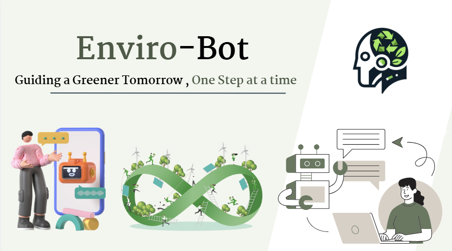

# Enviro-Bot 🌱

  

## Guiding a Greener Tomorrow, One Step at a Time

Enviro-Bot is an innovative AI-powered chatbot solution designed to promote environmental sustainability and eco-conscious decision-making through personalized interactions and guidance.

## 🌟 Features

- **AI-Powered Conversations**: Engage in natural conversations about environmental topics
- **Personalized Guidance**: Receive customized sustainability recommendations
- **Educational Content**: Learn about environmental issues and solutions
- **Action Tracking**: Monitor your progress towards sustainable goals
- **Community Integration**: Connect with like-minded individuals and share experiences

## 🎯 Mission

Our mission is to make environmental sustainability accessible and actionable for everyone through intelligent, conversational AI technology. We aim to bridge the gap between environmental awareness and practical, everyday actions.

## 💡 How It Works

1. **Chat Interface**: Users interact with Enviro-Bot through a friendly chat interface
2. **Smart Analysis**: AI processes user inputs to understand environmental concerns
3. **Personalized Recommendations**: Provides tailored sustainable living suggestions
4. **Progress Tracking**: Monitors and celebrates user achievements
5. **Continuous Learning**: Adapts and improves based on user interactions

## 🌍 Impact

- Promote sustainable lifestyle choices
- Increase environmental awareness
- Reduce individual carbon footprints
- Build a community of eco-conscious individuals
- Contribute to global sustainability goals

  Made with 💚 for a sustainable future

